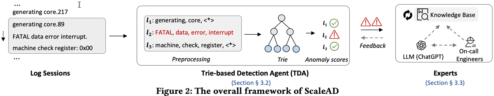
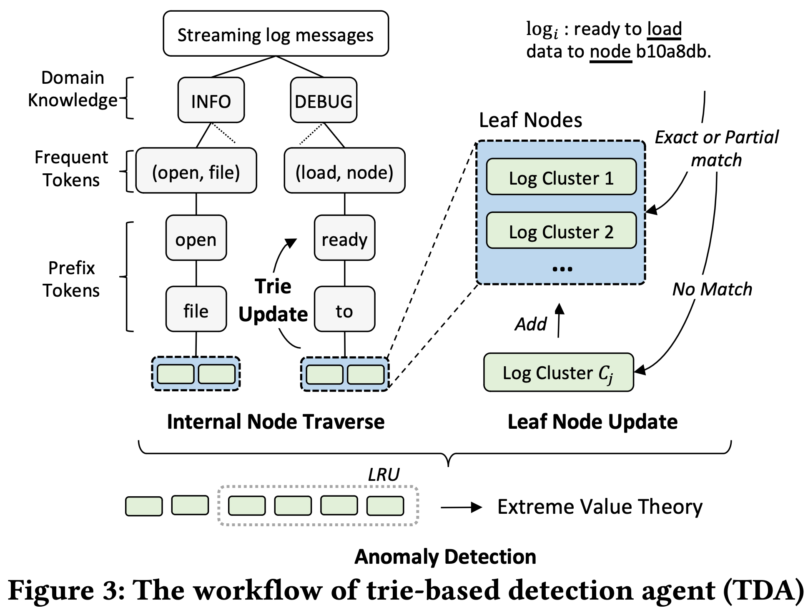
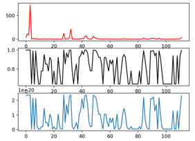
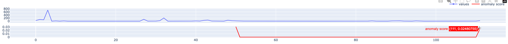
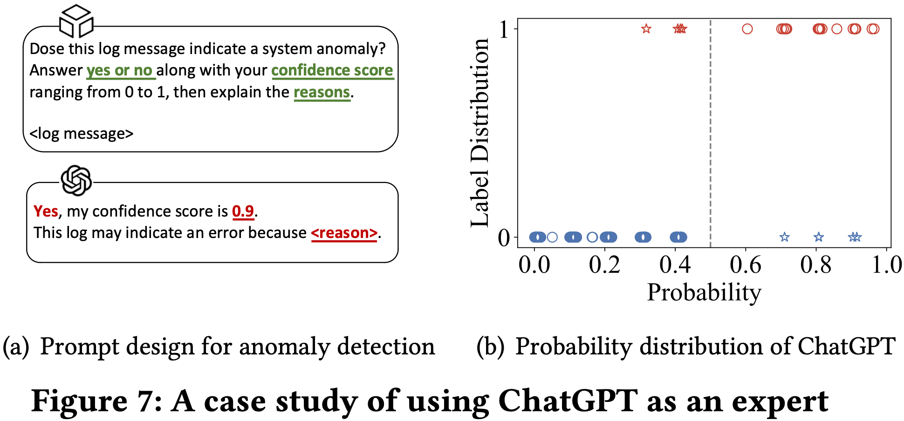

# Proposal based on "Log-based Anomaly Detection based on EVT Theory with feedback"



## Research

13 types of log pattern parsing, also summary of "Tools and Benchmarks for Automated Log Parsing": https://zhuanlan.zhihu.com/p/498522888

## Trie-based Detection Agent(TDA)

TDA workflow:


## Implemet TDA

Steps following Chapter 3 of TDA paper.

### 1. Preprocess

Goal: Tokenize log messages.

- split log incoming log messages by raw;
- extract parameter fields using library [Logparser](https://github.com/logpai/logparser). in this step, pre-define regular expressions is required.
- tokenize

### 2. Internal node traverse

What is trie: [leetcode](https://leetcode.cn/problems/implement-trie-prefix-tree/description/)

- Traverse by domain knowledge
- Traverse by most frequent tokens:
  There should be an global variant to maintain occurance of vocabulary. (detail: don't count English stopwords, e.g. “red”, "my")
- Traverse by prefix tokens
  prefix tokens may be parameters, use hyper-parameter $c_{max}$ to limit the max number of child nodes. Example, when $c_{max}=3$:
  open
  |_folder1
  |_folder2
  |_folder3
  |_<*>

### 3. Leaf node update

extract log template.
$C_{i}=(L_{i}, t_{i})$

```
// leaf node elements
struct Logcluster{
  log_messages: list(string);  // IDs of log messages
  template: string;  // templates shared by these log_messages
  count: int;
};
```

Goal: find a Log Cluster that best match the incoming log.

got three matching appoarchs: exact match, partial match and not match

#### 3.1 template update:

when? add an ID into LogCluster.log_messages(i.e. match).

#### Terms:

tokenized template: $\hat{t}_{i}$

template of Log Cluster i(i.e. not tokenized): $t_{i}$

#### Example:

old cluster template $t_{i}$: `$batch GET /PDSyncErrors?<*> 200`

already existed log list:

```bash
$batch GET /PDSyncErrors?$count=true&$select=ID,createdAt,errorItemCount,jobId,overallStatus,subdomain&$expand=toCustomer($select=CustomerId,Name)&$filter=subdomain%20eq%20'maco-consumer-1'&$skip=0&$top=30 200

$batch GET /PDSyncErrors(4015c1a5-7951-4e9b-9edc-633d9ef6febd)/pdSyncErrorItems/$count?$filter=(itemStatus%20eq%20'Missing') 200
```

incoming log message $l_{i}$ : `$batch POST /PDSyncErrors(e094c0cf-3518-4dd5-925f-8e861f89ece3)/MasterDataService.recheck 500`

> First, identify the common set of tokens shared by both $t_{i}$ and $l_{i}$:

`[$batch, /PDSyncErrors]` (note: splitter of tokens can be "?"?)

> Next, we choose the (existed log)list that has more tokens between $\hat{t}_{i}$ and $\hat{l}_{i}$.

> Finally, we replace any token in the longger list that is not in the common token set with the placeholder “<*>”

```bash
$batch <*> /PDSyncErrors<*> <*>, params:[?$count=true&$select=ID,createdAt,errorItemCount,jobId,overallStatus,subdomain&$expand=toCustomer($select=CustomerId,Name)&$filter=subdomain%20eq%20'maco-consumer-1'&$skip=0&$top=30, 200]

$batch <*> /PDSyncErrors<*> <*>, params:[(4015c1a5-7951-4e9b-9edc-633d9ef6febd)/pdSyncErrorItems/$count?$filter=(itemStatus%20eq%20'Missing')], 200

$batch <*> /PDSyncErrors<*> <*>, params:[(e094c0cf-3518-4dd5-925f-8e861f89ece3)/MasterDataService.recheck, 500]
```

Generated new template for Log Cluster i: `<*> /PDSyncErrors<*> <*>`

### 4. Trie update

WHY: false templates can be produced **before** a sufficient number of log messages accumulate.

bottom-up Trie update approach:

1. merges log clusters **sharing** the same template into a single cluster;
2. re-constructs the Trie based on the new template of the merged log cluster.

details:

1. $S_{c}=[C_1, C_2, ..., C_M]$: Log Cluster candidates shares the same "domain knowledge" and "frequent token" internal nodes. i.e. **share internal nodes EXCEPT "Prefix Token" nodes**.
2. Sort candidates based on the number of “<∗>”. Decending.
3. Iterate through candidate templated. Check if **PRECEDING** template **contains** the **SUCCEEDING** one.
4. If so, (1)delete SUCCEEDING one. (2)merge its logs into the preceding.
5. How to determine "CONTAINS"? Generate regex from the preceding template, check if it matches succeeding template.

advance:

TDA effeciency:
trigger Trie updates periodically, such as every million lines of log messages.

### 5. Anomaly detection

Main idea: detecting templates that appear significantly **less frequently** than others.

> we leverage the Generalized Extreme Value (GEV) distribution within the Extreme Value Theory (EVT) framework

#### Extreme Value Theory (EVT) framework

##### 5.1 StreamAD

- [StreamAD](https://github.com/Fengrui-Liu/StreamAD)
- [基于极值理论的单变量时间序列流式异常检测算法SPOT/DSPOT](https://blog.csdn.net/m0_37935211/article/details/122566605)
- [基于极值理论的流数据实时异常检测(SPOT/DSPOT, KDD'17)](https://zhuanlan.zhihu.com/p/337022414)

##### 5.2 generalized extreme value(GEV)：

- scipy: https://docs.scipy.org/doc/scipy/reference/generated/scipy.stats.genextreme.html
- pyextremes: https://github.com/georgebv/pyextremes

docs from Scipy org: https://docs.scipy.org/doc/scip`y/tutorial/stats.html

#### Cumulative Distribution Function results.

figure1: original log cluster occurance distribution

figure2: cdf

figure3: anomaly score tp, with T=10



#### StreamAD results



#### Least-Recently-Used (LRU) strategy

limit the number of log templates considered for fitting the distribution

1. Maintain **most recently seen** log templates in LRU.
2. Discards the **least recently used** templates, when reaching thereshold $R$.

### 6. Leveraging Expert Feedback and a solution(RAG)

#### Integrate GPT

Intended UI Design(Figure 7(a)):



#### defects of GPT in paper:

> 1. ChatGPT may miss some anomalies if log messages lack evident **semantics** that indicate an error.
> 2. the normal logs that are wrongly classified as abnormal were subtle anomalies that engineers typically disregard, such as "failed to login, wrong password."
>    Such logs often contain keywords such as "failed," indicating abnormal semantics.

### RAG - Retrieval Augmented Generation techniques

https://readmedium.com/advanced-rag-techniques-an-illustrated-overview-04d193d8fec6

## Further development planning

- go on optimize TDA, especially implement LRU,
  - ----> TDA has been optimized partly. LRU is the first priority implementation.
- design and implement a UI for monitoring
  - ---> Done. but UI layout is not friendly, adjust it later.
- [RAG](https://readmedium.com/advanced-rag-techniques-an-illustrated-overview-04d193d8fec6): take a survey first
  - [Verba](https://github.com/weaviate/Verba)
  - [selfrag](https://selfrag.github.io/)
- the effect of CDF correctness is terrible, need some research.
- how to deal with most frequent tokens? current approach has many flaws.
- persist trie tree!

## UI Design

There are two part of UI content:

- One for on-call users: Display anomaly logs and their details. Display potential logs based on GEV theory-Waiting for on-call engineers or GPT's feedback.
- Another for monitoring: Display TDA tree and its change(eg. after "Update Trie" step);

## Developing notes and Papers

Django simple demo: https://blog.csdn.net/m0_46192045/article/details/118084087
fix Django double load:https://blog.csdn.net/qq_39147299/article/details/117474908

OpenAi return json object: https://platform.openai.com/docs/guides/text-generation/json-mode

a high-yield scholar: https://petertsehsun.github.io/

Milvus standalone installation: https://milvus.io/docs/install_standalone-docker.md
how to restart Milvus server if it's down?
- check docker status: `systemctl status docker`. if it's inactive, start the daemon: `sudo systemctl status docker`
- run shell: `bash standalone_embed.sh start`
start Attu for UI monitoring: (https://github.com/zilliztech/attu)
- docker run -p 8888:3000 -e MILVUS_URL=10.58.137.244:19530 zilliz/attu:v2.4.0